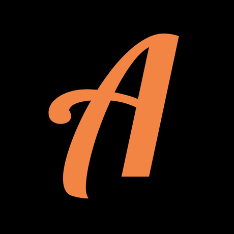

Das Projekt "Republik der Zukunft" ist ein kulturpädagogisches Projekt, was sich mit den Jahren 1989 und 1990 und mit den damals stattgefundenen
Umbrüchen in der Gesellschaft beschäftigt. Beleuchtet werden die friedliche Revolution und
die Wiedervereinigung am Beispiel von Jena. 

Hierzu haben wir uns mit der multimedialen App Actionbound einen erlebnisorientierten Ansatz zur Vermittlung der historischen Ereignisse ausgewählt.

Schüler*innen des Adolf-Reichwein-Gymnasiums konnten nicht nur einen Blick auf die Geschichte werfen, sondern beschäftigten sich auch mit Problemen in der heutigen Zeit.

Der Dokumentarfilm konzentriert sich auf die Arbeit an der Schule und gewährt einen Einblick in die Präsentation am 3. Oktober in der Jenaer Innenstadt. 







Erlebe durch die Augen der 16-jährigen Nicole die politischen und sozialen Umbrüche der Wendezeit.










 Dieser Bound entstand durch Schüler*innen des Adolf-Reichwein-Gymnasiums. 








